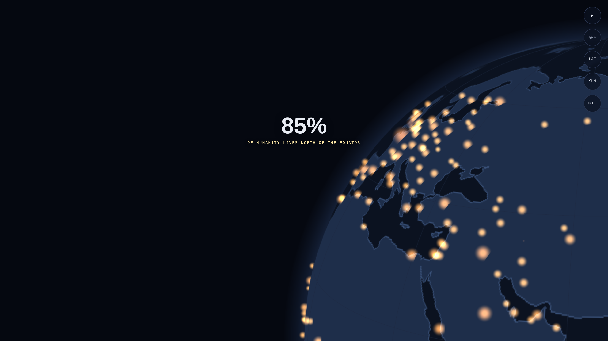

# Population Globe

 

> 87% of humanity lives north of the equator — an interactive 3D visualization in a single HTML file

**[▶ Live demo](https://cliffordmckenna.com/maps/)**

## Features

- Rotating 3D Earth with real Natural Earth coastlines
- ~330 cities as glowing, population-scaled dots (amber = Northern Hemisphere, cyan = Southern)
- Pulsing equator ring with the 87% / 13% population split
- The **Valeriepieris circle** — more people live inside it than outside (~3,300 km radius, centered near Mong Khet, Myanmar)
- Animated latitude sweep with a live population counter
- Real-time day/night terminator computed from the actual solar position (city lights brighten at night)
- Tap any city name for its population + live local time
- Auto-playing count-up intro animation
- Works on mobile (touch drag / pinch) and desktop

## Usage

Download `index.html` and open it in any browser. That's it — no build, no dependencies, no server.

> It loads Three.js and two Google Fonts from CDNs, so it needs an internet connection on first load.

## Controls

- **Drag** to spin the globe
- **Pinch / scroll** to zoom
- **Tap a city name** for its population and local time
- Buttons for: **pause**, **Valeriepieris circle**, **latitude sweep**, **day/night terminator**, and **intro replay**

## Credits

- [Three.js](https://threejs.org/) (MIT, via CDN)
- Coastline data from [Natural Earth](https://www.naturalearthdata.com/) (public domain)
- Fonts [Space Grotesk](https://fonts.google.com/specimen/Space+Grotesk) and [IBM Plex Mono](https://fonts.google.com/specimen/IBM+Plex+Mono) via Google Fonts (OFL)
- Population figures are approximate metro-area estimates

## License

MIT — see [LICENSE](LICENSE).

---

Built by [Clifford McKenna](https://cliffordmckenna.com) with Claude.
